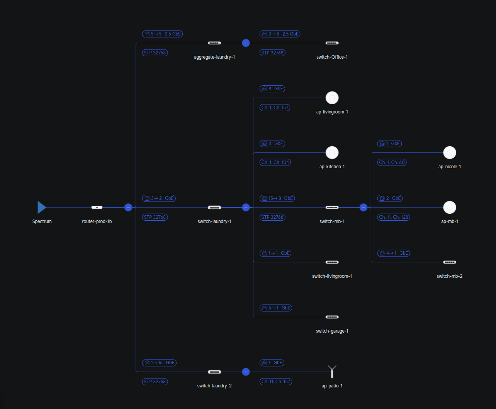

# Network Architecture Documentation

## 🌐 Overview
This document describes the UniFi-based network architecture for the local environment. It is designed with a focus on high-speed backbone connectivity (up to 2.5 GbE) and strict logical segmentation for security.

## 🏗️ Physical Topology
The network originates from a **Spectrum** ISP connection and is distributed through a series of UniFi switches and Access Points.

## 🔢 Logical Segmentation (VLANs)

The network uses VLANs to isolate management traffic from IoT and guest devices.
VLAN,Name,Subnet,Purpose
 
1. Management,X.X.X.X/24,Infrastructure & Gateway management.
2. DMZ,X.X.X.X/24,Isolated services.
3. Home,X.X.X.X/24,Primary trusted devices (SSID: EMILIKESBIKES).
4. IoT,X.X.X.X/24,Smart home/untrusted devices (SSID: E-IoT).v

## 📶 Wireless Configuration (SSIDs)
Wireless networks are mapped to specific VLANs to ensure device security.

- SSID,Network,Bands,Security,Notes

- EMILIKESBIKES,Home (VLAN 5),"2.4 GHz, 5 GHz",WPA2,Trusted personal devices.

- E-IoT,IoT (VLAN 6),2.4 GHz,WPA2,Isolated smart home devices.

## Radio & Optimization
5 GHz Roaming Assistant: Enabled at -60 dBm threshold for smooth handoffs.

-  Channel Widths: 2.4 GHz is set to 20 MHz; 5 GHz is set to 80 MHz for peak performance.

## 🛠️ Hardware Inventory

Device Name,Role,Primary Connectivity

- router-prod-1b,Gateway / Console,Primary WAN Termination

- aggregate-laundry-1,Core Aggregation,2.5 GbE SFP+

- switch-laundry-1,Main Switch,GbE PoE Distribution

- switch-Office-1,Office Switch,2.5 GbE Performance

- ap-livingroom-1,Access Point,Main Floor Coverage

- ap-patio-1,Access Point,Outdoor Coverage

## 🔒 Security Posture

Inter-VLAN Routing: Firewall rules are configured to prevent VLAN 6 (IoT) from reaching VLAN 5 (Home).

- Redaction Policy: This file intentionally replaces all internal IP schemes with X.X.X.X and omits MAC addresses to maintain repository privacy.